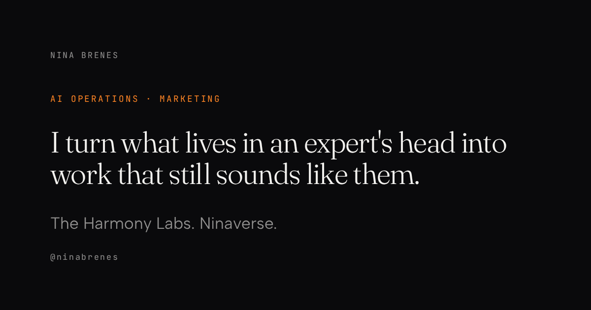

I am a marketer who builds. My work is turning what lives in one expert's head
into operations they can actually run: what to automate first, how the work
happens today, and the playbooks that make it repeatable without sounding like
a machine wrote them.

Two places, one person. [**The Harmony Labs**](https://theharmonylabs.com) is my
studio, where this is client work. [**Ninaverse**](https://ninaverse.blog) is
personal, where I write about staying yourself while the tools change.

Everything here is open. Take it, fork it, make it sound like you.

## Tools

Things I use most weeks, published so you can use them too.

| Tool | What it does |
|---|---|
| [**carousel-studio**](https://github.com/ninabrenes/carousel-studio) | Turn a newsletter, post, or transcript into on-brand carousel slides and infographics. Preview the feed grid, download post-ready PNGs. No design tool, no API key, and nothing leaves your machine. |
| [**ai-operations-skills**](https://github.com/ninabrenes/ai-operations-skills) | Ten skills for the decisions that come before the prompt. What to automate first, who owns what, and whether a process is worth building at all. |

Both install into Claude Code in one line:

```
/plugin marketplace add ninabrenes/carousel-studio
/plugin marketplace add ninabrenes/ai-operations-skills
```

## Websites

Design and build, end to end. Next.js, TypeScript, Tailwind, scroll-driven
motion, deployed on Vercel. Bilingual where the audience needs it.

Client source is private, so the live site is the portfolio. Happy to walk
through the code on a call.

| Site | What it is |
|---|---|
| [**theharmonylabs.com**](https://theharmonylabs.com) | My studio. AI operations implementation, with web design as the second offer. Bilingual, English at the root and Spanish for LATAM. |
| [**ninaverse.blog**](https://ninaverse.blog) | Personal site. Writing, the lab, the newsletter, a visual diary. Dark editorial, MDX, custom typography. |
| [**lideraconfi.com**](https://lideraconfi.com) | Leadership consultancy for the Costa Rica contact-center and BPO world. Two audiences on one story, plus an ADKAR readiness quiz. |
| [**mayidbrenes.com**](https://mayidbrenes.com) | Practice site for a Costa Rican attorney and notary, 30 years in public law and energy. Includes a severance calculator built for prospective clients. |

## Systems

Smaller builds, each showing one pattern worth stealing.

| Build | The pattern |
|---|---|
| [**claude-ops-agent**](https://github.com/ninabrenes/claude-ops-agent) | Operations triage with a human approval gate before anything consequential happens. |
| [**maker-checker-pipeline**](https://github.com/ninabrenes/maker-checker-pipeline) | Two agents, scored evaluation, a feedback loop, capped revisions. Quality control that terminates. |
| [**doc-intelligence-agent**](https://github.com/ninabrenes/doc-intelligence-agent) | Document ingestion that extracts typed JSON and validates it against a strict schema. |
| [**webhook-automation-hub**](https://github.com/ninabrenes/webhook-automation-hub) | A webhook listener that classifies incoming business events and routes them. |
| [**agent-eval-harness**](https://github.com/ninabrenes/agent-eval-harness) | Deterministic evaluation with test cases, latency tracking, and run history. |
| [**ai-for-normal-people**](https://github.com/ninabrenes/ai-for-normal-people) | A guide to AI for people who do not write code. The one I wanted when I started. |

## Writing

I publish [**Hermit Diaries**](https://ninaverse.blog/newsletter) every week.
One idea about building with AI without losing your judgment, written as prose
rather than a listicle.

The [**lab**](https://ninaverse.blog/lab) is where the experiments live,
including the ones that failed. Those get published too.

## How I work

Plain over impressive. Specific over general. Honest about limits.

Automate the boring, keep the judgment. Every system here assumes a human stays
in the loop on anything that matters, because a system you do not trust is a
system you will quietly stop using.

I am not an engineer by training. Marketing first, then operations, then
building the tools myself because waiting for someone else to build them was
slower. If you are somewhere on that same path, the repositories above are the
shortcut I did not have.

## Elsewhere

[LinkedIn](https://linkedin.com/in/ninabrenes) ·
[ninaverse.blog](https://ninaverse.blog) ·
[The Harmony Labs](https://theharmonylabs.com)

Anthropic AI Fluency · DeepLearning.AI Agentic AI · AMP AI Operator · Google PMP

Claude Code, Python, TypeScript, n8n, Trigger.dev. Costa Rica.

---

**Start here:** [read the newsletter](https://ninaverse.blog/newsletter). One a
week, no course, no funnel.
